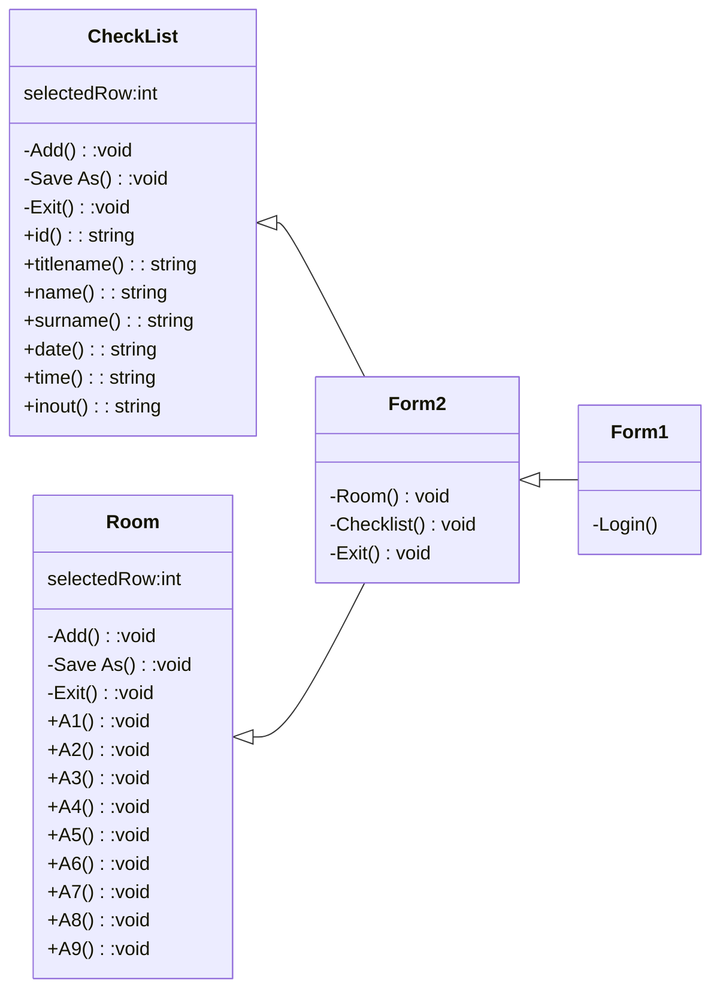

# ความเป็นมาของโปรแกรม
- โปรแกรมที่1 คือการเช็คชื่อคนเข้าออกเหมือนในห้องสมุดตอนประถมที่จะต้องมีการเช็คชื่อก่อนเข้า-ออกห้องสมุด โปรแกรมนี้สามารถเช็คคนเข้าออกแล้วเก็บข้อมูลลง DataGridView เพื่อ Export เป็นไฟล์ CSV สามารถเช็คย้อนหลังได้
- โปรแกรมที่2 คือการจองห้องเรียนแบบง่ายๆเพื่อความเข้าใจของผู้จองและยังสามารถเก็บข้อมูลจาก DataGridView และ Export เป็นไฟล์ CSV สามารถเช็คย้อนหลังได้

# วัตถุประสงค์ของโปรแกรม
เพื่อพัฒนาระบบและประเมินประสิทธิภาพของทั้ง2โปรแกรม

# Class Diagram

# ผู้พัฒนาโปรแกรม
นายก้องภพ ตาดี รหัสนักศึกษา 643450312-2
